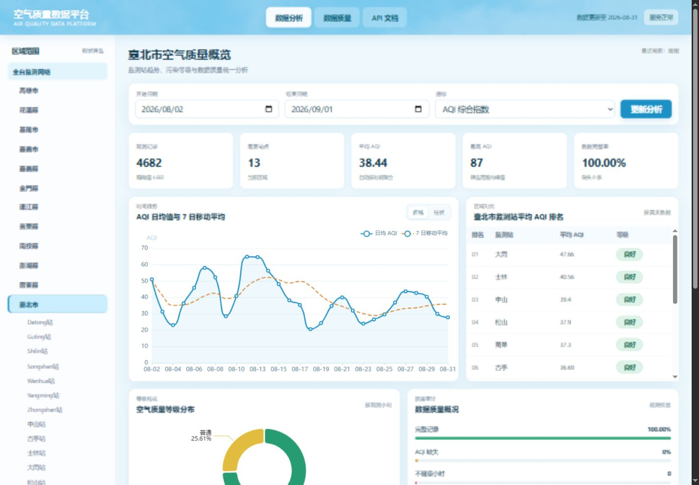
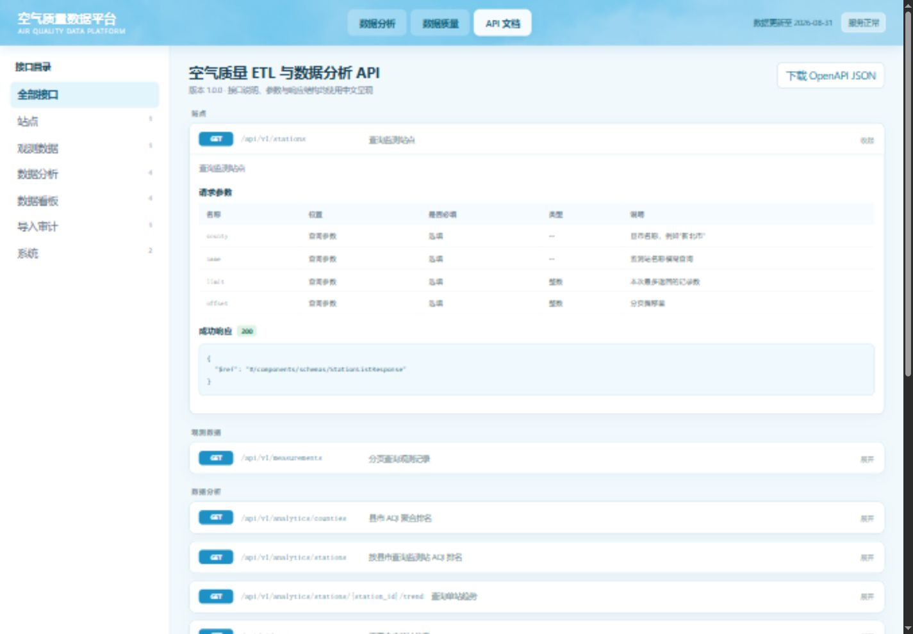

# Air Quality ETL & Analytics API

面向台湾环境部 `AQX_P_488` 月度历史资料的 Python 数据处理与查询服务。项目将 118 个月 CSV 以固定大小分块读取，完成类型转换、数据质量检查、县市维度标准化、双语重复记录消重，并通过 PostgreSQL 批量入库。FastAPI 提供游标分页与聚合查询，Vue 3 + ECharts 中文看板提供交互式数据分析。

> 当前本地数据快照：2016-11 至 2026-08，118 个 CSV，约 1.02 GB、7,286,899 行。这里的行数来自本地文件实测，不代表数据源会永久保持相同规模。

## 页面预览

数据分析看板 | 中文 API 文档
--- | ---
 | 

## 为什么不是直接 `pandas.read_csv()`

单月文件虽然不大，但完整历史数据已达到百万级。如果一次加载全部文件，会让内存占用随数据量线性增长，也无法在中断后从已完成位置恢复。本项目采用：

1. 按月发现文件并校验固定字段契约。
2. 默认每 50,000 行读取一个 DataFrame。
3. 向量化清洗与质量判定。
4. 使用 PostgreSQL `COPY` 写入临时表。
5. 从临时表批量合并站点和观测事实。
6. 每批提交导入游标，失败后跳过已提交行。

## 数据质量规则

- `site_name`、`county` 或观测时间缺失：拒绝。
- AQI 大于 500：拒绝；数据源用 `-1` 表示缺测时转换为空值并记录质量标记。
- 经纬度超出合法范围：拒绝。
- AQI、经纬度或源站点 ID 缺失：保留记录并写入质量标记。
- 同一“县市 + 站点 + 时间”或同一 `source_site_id + observed_at` 重复：保留一条，另一条进入质量问题表。
- 22 个英文县市名称统一转换为中文，避免县市聚合被拆成 44 组。
- 历史文件中的 `siteid` 会跨年份复用，因此它只作为来源属性；站点维度以“县市 + 站点名”作为唯一身份。
- 2026 年部分月份同时提供中英文记录：优先保留中文站点名称。
- 输入行出现 Unicode 替换字符 `�`：拒绝该行，避免损坏维表。

当前 118 个文件的完整验证结果：

| 指标 | 实测数量 |
| --- | ---: |
| 源记录 | 7,286,899 |
| 清洗后可入库 | 7,022,277 |
| 拒绝/消重 | 264,622 |
| 同站同时间重复 | 261,101 |
| 缺少站点或县市 | 3,521 |
| `-1` AQI 哨兵值（保留并置空） | 10,111 |

缺少站点或县市的 3,521 行均能在同月找到相同 `siteid + observed_at` 的完整记录，因此没有损失唯一观测。质量标记不是互斥分类：同一行可能同时缺少源站点 ID、坐标或 AQI。上述数字来自当前本地数据和当前规则；修改规则后必须重新运行验证，不能直接作为固定性能结论。

一次本机热缓存验证耗时 56.287 秒，约 129,460 行/秒、17.32 MiB/秒。该结果只覆盖 CSV 读取、转换和质量检查，不包含 PostgreSQL 入库；正式性能结论应在固定硬件上多次运行并报告中位数。

2026-09-21 在当前开发机上进行了一次 Docker + PostgreSQL 16 的干净全量导入：118 个文件全部成功，耗时 365.192 秒；数据库中有 7,022,277 条观测、228 个站点标签、22 个县市和 264,622 条质量问题，数据库约 2.03 GiB。立即重复执行耗时 5.298 秒，118 个文件全部按 SHA-256 跳过。这些是单机单次实测，不应直接外推为生产环境 SLA。

## 架构

```text
AQX_P_488 monthly CSV
        │
        ▼
file discovery + schema check + SHA-256
        │
        ▼
chunked extract (50,000 rows)
        │
        ▼
vectorized transform + validation + deduplication
        │
        ├── rejected ──► data_quality_issue
        │
        ▼
PostgreSQL COPY ──► temporary staging table
        │
        ▼
station UPSERT + measurement UPSERT
        │
        ▼
FastAPI query and analytics endpoints
        │
        ▼
Pandas / NumPy derived analytics
        │
        ▼
Vue 3 + ECharts Chinese dashboard
```

核心表：

- `air_quality.import_file`：文件哈希、状态、计数和断点位置。
- `air_quality.station`：测站、县市和坐标。
- `air_quality.measurement`：逐站逐小时 AQI 和污染物指标。
- `air_quality.data_quality_issue`：拒绝原因和源文件行号。

## 本地验证

```powershell
git clone https://github.com/Shuaige-Da/Backend-projects-for-my-resume.git
cd Backend-projects-for-my-resume/air-quality-etl-api

python -m venv .venv
.\.venv\Scripts\python.exe -m pip install -r requirements-dev.txt

$env:PYTHONIOENCODING = "utf-8"
.\.venv\Scripts\python.exe main.py --mode validate `
  --data-dir "D:\data\AQX_P_488_Resource"
```

`validate` 只读取文件，不连接数据库，也不会修改源数据。

## Docker 启动与导入

Docker Desktop 已启动但当前 PowerShell 找不到 `docker` 时，可以只为当前终端补充路径：

```powershell
$dockerBin = "$env:LOCALAPPDATA\Programs\DockerDesktop\resources\bin"
$env:Path = "$dockerBin;$env:Path"
docker --version
docker compose version
```

复制环境变量模板：

```powershell
Copy-Item .env.example .env
```

编辑 `.env` 中的数据目录和数据库密码。Windows 路径建议使用正斜杠；如果本机 PostgreSQL 已占用 `5432`，将 `DB_PORT` 改成 `55432`。然后执行：

```powershell
docker compose up -d --build
docker compose ps

# 先检查全部源文件，只读、不写数据库
docker compose run --rm api python main.py --mode validate --data-dir /data/aqi

# 先导入一个月做冒烟验证
docker compose run --rm api python main.py --mode load `
  --data-dir /data/aqi --limit-files 1

Invoke-RestMethod http://localhost:8000/health
Invoke-RestMethod http://localhost:8000/api/v1/stats

# 再导入全部月份；已完成的第一个月会自动跳过
docker compose run --rm api python main.py --mode load --data-dir /data/aqi
```

重复导入同一文件时以 SHA-256 识别；已完成文件会跳过，失败文件会从最后成功提交的源行继续。

启动后访问：

- 中文数据分析看板：`http://localhost:8080`
- 中文交互式 API 文档：打开 `http://localhost:8080` 后切换到“API 文档”
- FastAPI 原生 Swagger（开发调试）：`http://localhost:8000/docs`

导入结束后可执行数据库一致性检查：

```powershell
Get-Content .\sql\quality_checks.sql -Raw |
  docker compose exec -T db psql -U air_quality -d air_quality -P pager=off
```

停止服务但保留数据库使用 `docker compose stop`。`docker compose down` 会删除容器但默认保留命名卷；`docker compose down -v` 会连数据库卷一起删除，只能在明确要从零重建时使用。

## API

```powershell
docker compose up -d --build
```

打开 `http://localhost:8000/docs` 查看 Swagger。

主要接口：

- `GET /health`：数据库健康检查。
- `GET /api/v1/stats`：数据规模、时间范围和数据库大小。
- `GET /api/v1/stations`：按县市或名称查询测站。
- `GET /api/v1/measurements`：按站点、时间和 AQI 过滤，使用游标分页。
- `GET /api/v1/analytics/counties`：县市 AQI 聚合排名。
- `GET /api/v1/analytics/stations`：按县市统计其下属监测站 AQI 排名。
- `GET /api/v1/analytics/stations/{station_id}/trend`：小时、日或月趋势。
- `GET /api/v1/dashboard/overview`：筛选范围内的看板核心指标。
- `GET /api/v1/dashboard/trend`：Pandas 计算日/月趋势与移动平均。
- `GET /api/v1/dashboard/distribution`：NumPy 加权直方图和 AQI 等级分布。
- `GET /api/v1/dashboard/correlation`：Pandas 污染物相关性矩阵。
- `GET /api/v1/imports`：导入任务、成功/拒绝计数和错误信息。

## 中文可视化看板

前端位于 `frontend/`，由 Vue 3、Vite 和 ECharts 构建，Nginx 负责静态资源与 API 反向代理。当前包含：

- 全台 → 县市 → 监测站树状筛选；源数据没有行政区字段，因此不虚构区县。
- 日期与县市联动筛选。
- 观测量、站点数、平均/最高 AQI、不健康小时和缺失率指标卡。
- AQI 折线图/柱状图与 7 日移动平均。
- 全台视角展示县市排名，选择县市后切换为其下属监测站排名。
- AQI 数值直方图和空气质量等级饼图。
- AQI、PM2.5、PM10、O₃、NO₂、CO、SO₂ 相关性热力图。
- 观测明细和 ETL 导入审计表。
- 由 OpenAPI 元数据生成的中文接口目录、参数表和响应结构展开页。

大数据聚合由 PostgreSQL 完成，Pandas/NumPy 处理聚合后的趋势、加权分箱和相关性矩阵，避免为展示技术栈而将 702 万行数据一次性加载进 Python 内存。

## 测试

```powershell
.\.venv\Scripts\python.exe -m pytest -q
```

默认情况下 PostgreSQL 集成测试会跳过。需要执行集成测试时，给它指定独立测试库，避免测试夹具删除业务 schema：

```powershell
$env:TEST_DATABASE_URL = `
  "postgresql+psycopg2://air_quality:<你的密码>@localhost:55432/air_quality_test"
.\.venv\Scripts\python.exe -m pytest -q
```

## 来源与改造说明

数据来自台湾环境部开放数据平台的 [AQX_P_488 空气品质指标历史资料](https://data.moenv.gov.tw/dataset/detail/AQX_P_488)。

项目最初以 MIT 许可的 [`bryanmg20/secop2-etl-pipeline`](https://github.com/bryanmg20/secop2-etl-pipeline) 为结构参考。采购领域的数据模型、提取逻辑、查询接口和文档已被替换；保留并扩展了分层 ETL、增量思想、PostgreSQL 与 FastAPI 的工程方向。
